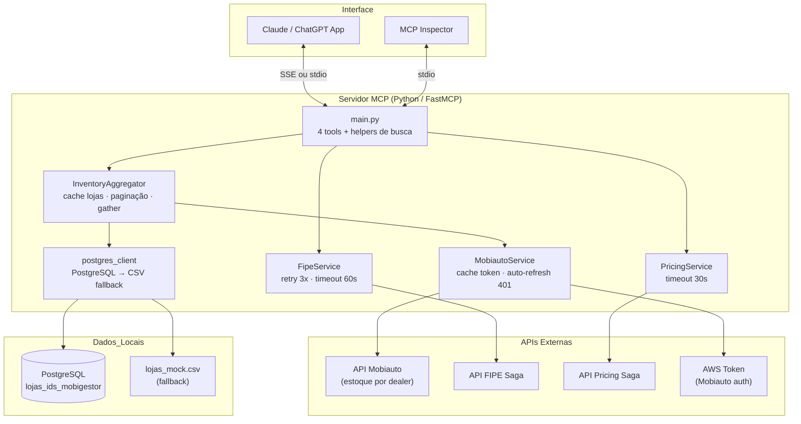

# Arquitetura: MCP Primeira Mão Saga

---

## Camadas

| Camada | Componente | Responsabilidade |
|---|---|---|
| **Interface** | FastMCP (stdio / SSE) | Expõe as tools para LLMs e MCP Inspector |
| **Tools** | `main.py` | Define as 4 tools, extração de palavras-chave, lógica de renderização |
| **Serviços** | `InventoryAggregator` | Orquestra busca paralela por loja, paginação, cache de lojas e token |
| **Serviços** | `FipeService` | Consulta FIPE pela placa com retry (3x, 60s timeout) |
| **Serviços** | `PricingService` | Envia payload para API de precificação Saga e retorna proposta |
| **Dados** | `MobiautoService` | Consulta estoque da API Mobiauto por dealer ID (sem paginação) |
| **Dados** | `postgres_client` | Retorna lista de lojas do PostgreSQL ou CSV fallback |
| **Utilitários** | `helpers.py` | Normalização de placa, formatação de moeda, extração de lista de veículos |

---

## Serviços externos

| API | Endpoint base | Uso |
|---|---|---|
| **Mobiauto** | `open-api.mobiauto.com.br` | Estoque por dealer — retorna todos os veículos sem paginação |
| **FIPE Saga** | `api-precificacao.sagadatadriven.com.br/fipe` | Dados técnicos e valor FIPE pela placa |
| **Pricing Saga** | `api-precificacao.sagadatadriven.com.br/carro/compra` | Proposta de compra/troca |
| **Token AWS** | Configurado via `URL_AWS_TOKEN` + `MOBI_SECRET` | Bearer token para autenticar na Mobiauto |

---

## Cache em memória

| Cache | Onde | O que guarda |
|---|---|---|
| `_token_cache` | `MobiautoService` | Bearer token Mobiauto — renovado automaticamente no 401 |
| `_lojas_cache` | `InventoryAggregator` | Lista de lojas + fonte (`banco` ou `mock`) — carregado uma vez por sessão |

---

## Configurações relevantes (`config.py` / `.env`)

| Variável | Padrão | Descrição |
|---|---|---|
| `API_TIMEOUT` | 30s | Timeout geral (Mobiauto, Pricing) |
| `FIPE_TIMEOUT` | 60s | Timeout exclusivo da API FIPE (mais lenta) |
| `MCP_TRANSPORT` | `stdio` | `stdio` para Inspector/local, `sse` para produção |
| `PORT` | 8000 | Porta SSE em produção |
| `MOBI_SECRET` | — | Segredo para obter token Mobiauto |
| `URL_AWS_TOKEN` | — | Endpoint do token Mobiauto |
| `PRECIFICACAO_API_URL` | — | Base URL das APIs FIPE e Pricing |

---

## Diagrama de componentes



---

## Estrutura de arquivos

```
src/python/mcp_primeira_mao/
├── main.py                     # Tools MCP + helpers de busca e renderização
├── config.py                   # Variáveis de ambiente e logger
├── .env                        # Secrets (não versionado)
├── services/
│   ├── inventory_aggregator.py # Orquestração de estoque e paginação
│   ├── mobiauto_service.py     # Cliente Mobiauto (token + estoque)
│   ├── fipe_service.py         # Cliente FIPE com retry
│   └── pricing_service.py      # Cliente API de precificação
├── database/
│   ├── postgres_client.py      # Consulta lojas (banco ou CSV)
│   └── lojas_mock.csv          # Dados mock das lojas
└── utils/
    └── helpers.py              # normalizar_placa, formatar_moeda, extrair_lista_veiculos
```
