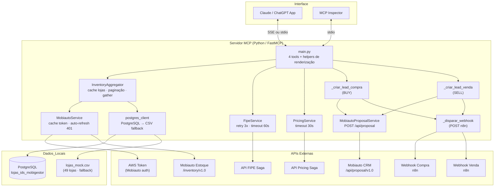

# Arquitetura: MCP Primeira Mão Saga

---

## Camadas

| Camada | Componente | Responsabilidade |
|---|---|---|
| **Interface** | FastMCP (stdio / SSE) | Expõe as tools para LLMs e MCP Inspector |
| **Tools** | `main.py` | 4 tools + funções internas de lead + helpers de busca e renderização |
| **Lead interno** | `_criar_lead_compra` | Cria lead BUY no CRM Mobiauto + dispara webhook compra |
| **Lead interno** | `_criar_lead_venda` | Cria lead SELL no CRM Mobiauto + dispara webhook venda |
| **Lead interno** | `_disparar_webhook` | POST async para endpoints n8n (compra / venda) |
| **Serviços** | `MobiautoProposalService` | POST `/api/proposal/v1.0/{dealer_id}` — cria proposta no CRM Mobiauto |
| **Serviços** | `InventoryAggregator` | Orquestra busca paralela por loja, paginação, cache de lojas e token |
| **Serviços** | `FipeService` | Consulta FIPE pela placa com retry (3x, 60s timeout) |
| **Serviços** | `PricingService` | Envia payload para API de precificação Saga e retorna proposta |
| **Dados** | `MobiautoService` | Consulta estoque da API Mobiauto por dealer ID; cache de token com auto-refresh |
| **Dados** | `postgres_client` | Retorna lista de lojas do PostgreSQL ou CSV fallback |
| **Utilitários** | `helpers.py` | Normalização de placa, formatação de moeda |

---

## Serviços externos

| API | Endpoint base | Uso |
|---|---|---|
| **Mobiauto — Estoque** | `open-api.mobiauto.com.br/api/dealer/{id}/inventory/v1.0` | Estoque por dealer — retorna todos os veículos sem paginação |
| **Mobiauto — CRM** | `open-api.mobiauto.com.br/api/proposal/v1.0/{dealer_id}` | Criação de lead/proposta (compra ou venda) |
| **FIPE Saga** | `{PRECIFICACAO_API_URL}/fipe` | Dados técnicos e valor FIPE pela placa |
| **Pricing Saga** | `{PRECIFICACAO_API_URL}/carro/compra` | Proposta de compra/troca |
| **Token AWS** | Configurado via `URL_AWS_TOKEN` + `MOBI_SECRET` | Bearer token para autenticar na Mobiauto (estoque + CRM) |
| **Webhook Compra** | `automatemaiawh.sagadatadriven.com.br/webhook/cliente_quer_comprar` | Notificação n8n quando lead de compra é criado |
| **Webhook Venda** | `automatemaiawh.sagadatadriven.com.br/webhook/cliente_quer_vender` | Notificação n8n quando lead de venda é criado |

---

## Cache em memória

| Cache | Onde | O que guarda |
|---|---|---|
| `_token_cache` | `MobiautoService` | Bearer token Mobiauto — renovado automaticamente no 401 |
| `_lojas_cache` | `InventoryAggregator` | Lista de lojas + fonte (`banco` ou `mock`) — carregado uma vez por sessão |

---

## Configurações relevantes (`config.py` / `.env`)

| Variável | Padrão | Descrição |
|---|---|---|
| `API_TIMEOUT` | 30s | Timeout geral (Mobiauto, Pricing) |
| `FIPE_TIMEOUT` | 60s | Timeout exclusivo da API FIPE (mais lenta) |
| `MCP_TRANSPORT` | `stdio` | `stdio` para Inspector/local, `sse` para produção |
| `PORT` | 8000 | Porta SSE em produção |
| `MOBI_SECRET` | — | Segredo para obter token Mobiauto |
| `URL_AWS_TOKEN` | — | Endpoint do token Mobiauto |
| `PRECIFICACAO_API_URL` | — | Base URL das APIs FIPE e Pricing |

---

## Diagrama de componentes



---

## Estrutura de arquivos

```
src/python/mcp_primeira_mao/
├── main.py                        # 4 tools + funções internas de lead + helpers
│                                  #   _criar_lead_compra  (BUY: CRM + webhook)
│                                  #   _criar_lead_venda   (SELL: CRM + webhook)
│                                  #   _disparar_webhook   (POST n8n)
│                                  #   _renderizar_card / _renderizar_cards
│                                  #   _extrair_palavras_chave / _score_veiculo
├── config.py                      # Variáveis de ambiente e logger
├── .env                           # Secrets (não versionado)
├── services/
│   ├── mobiauto_proposal_service.py  # POST /api/proposal → cria lead no CRM Mobiauto
│   ├── inventory_aggregator.py       # Orquestração de estoque e paginação
│   ├── mobiauto_service.py           # Token Mobiauto + busca de estoque por dealer
│   ├── fipe_service.py               # Cliente FIPE com retry (3x, 60s)
│   └── pricing_service.py            # Cliente API de precificação Saga
├── database/
│   ├── postgres_client.py         # Consulta lojas (PostgreSQL ou CSV fallback)
│   └── lojas_mock.csv             # 49 lojas Saga (fallback local)
├── utils/
│   └── helpers.py                 # normalizar_placa
├── test_lead.py                   # Testes: leads API + webhooks
└── test_tools.py                  # Testes: todas as tools e funções internas
```
