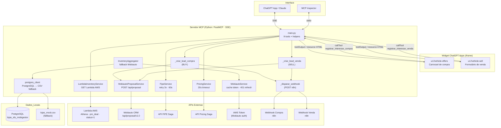

# Arquitetura: MCP Primeira Mão Saga

---

## Camadas

| Camada | Componente | Responsabilidade |
|---|---|---|
| **Interface** | FastMCP (SSE / stdio) | Expõe tools e resources para LLMs (ChatGPT, Claude) e MCP Inspector |
| **Widget** | `ui/vehicle-offers.js` + `.css` | Carrossel de veículos e formulário de venda — renderizado no iframe do ChatGPT Apps |
| **Resources MCP** | `ui://vehicle-offers` | HTML inline com payload de compra embutido (`_LAST_BUY_PAYLOAD`) |
| **Resources MCP** | `ui://vehicle-sell` | HTML inline com payload de venda embutido (`_LAST_SELL_PAYLOAD`) |
| **Tools** | `main.py` | 9 tools + funções internas de lead + helpers de busca e renderização |
| **Lead interno** | `_criar_lead_compra` | Cria lead BUY no CRM Mobiauto + dispara webhook compra |
| **Lead interno** | `_criar_lead_venda` | Cria lead SELL no CRM Mobiauto + dispara webhook venda |
| **Lead interno** | `_disparar_webhook` | POST async para endpoints n8n (compra / venda) |
| **Serviços** | `LambdaInventoryService` | GET para Lambda AWS com filtros; normaliza resposta para o contrato do widget |
| **Serviços** | `MobiautoProposalService` | POST `/api/proposal/v1.0/{dealer_id}` — cria proposta no CRM Mobiauto |
| **Serviços** | `InventoryAggregator` | Fallback Mobiauto — busca paralela por loja, paginação, cache |
| **Serviços** | `FipeService` | Consulta FIPE pela placa com retry (3x, 60 s timeout) |
| **Serviços** | `PricingService` | Envia payload para API de precificação Saga e retorna proposta |
| **Dados** | `MobiautoService` | Token Mobiauto + busca de estoque por dealer (fallback) |
| **Dados** | `postgres_client` | Retorna lista de lojas do PostgreSQL ou CSV fallback |
| **Utilitários** | `helpers.py` | Normalização de placa |

---

## Serviços externos

| API | Endpoint base | Uso |
|---|---|---|
| **Lambda AWS — Estoque** | Configurado via `LAMBDA_ESTOQUE_URL` | Consulta Athena (`modelled.pm_*`) e retorna veículos ativos filtrados por cidade |
| **Mobiauto — Estoque** | `open-api.mobiauto.com.br/api/dealer/{id}/inventory/v1.0` | Fallback de estoque (desabilitado por padrão) |
| **Mobiauto — CRM** | `open-api.mobiauto.com.br/api/proposal/v1.0/{dealer_id}` | Criação de lead/proposta (compra ou venda) |
| **FIPE Saga** | `{PRECIFICACAO_API_URL}/fipe` | Dados técnicos e valor FIPE pela placa |
| **Pricing Saga** | `{PRECIFICACAO_API_URL}/carro/compra` | Proposta de compra/troca |
| **Token AWS** | `URL_AWS_TOKEN` + `MOBI_SECRET` | Bearer token para autenticar na Mobiauto (estoque + CRM) |
| **Webhook Compra** | `automatemaiawh.sagadatadriven.com.br/webhook/cliente_quer_comprar` | Notificação n8n quando lead de compra é criado |
| **Webhook Venda** | `automatemaiawh.sagadatadriven.com.br/webhook/cliente_quer_vender` | Notificação n8n quando lead de venda é criado |

---

## Widget — recursos MCP separados por modo

Para evitar race condition entre sessões concorrentes, os payloads de compra e venda são armazenados em variáveis globais distintas e servidos por resources MCP diferentes:

| Variável | Setada por | Resource MCP | Template |
|---|---|---|---|
| `_LAST_BUY_PAYLOAD` | `buscar_veiculos` | `ui://vehicle-offers` | `openai/outputTemplate` de `buscar_veiculos` |
| `_LAST_SELL_PAYLOAD` | `exibir_formulario_venda` | `ui://vehicle-sell` | `openai/outputTemplate` de `exibir_formulario_venda` |

Ambos os resources servem o mesmo `vehicle-offers.js` / `vehicle-offers.css` (inlined), com hashes SHA-256 registrados em `openai/widgetCSP` para CSP do ChatGPT Apps.

---

## Cache em memória

| Cache | Onde | O que guarda |
|---|---|---|
| `_token_cache` | `MobiautoService` | Bearer token Mobiauto — renovado automaticamente no 401 |
| `_lojas_cache` | `InventoryAggregator` | Lista de lojas + fonte (`banco` ou `mock`) — carregado uma vez por sessão |

---

## Configurações (`config.py` / `.env`)

| Variável | Padrão | Descrição |
|---|---|---|
| `MCP_TRANSPORT` | `stdio` | `stdio` para Inspector/local, `sse` para produção |
| `PORT` | `8000` | Porta SSE em produção |
| `DB_HOST / DB_NAME / DB_USER / DB_PASSWORD / DB_PORT` | — | PostgreSQL para lista de lojas |
| `LAMBDA_ESTOQUE_URL` | — | URL do API Gateway da Lambda de estoque |
| `LAMBDA_API_KEY` | — | Chave de autenticação da Lambda (`x-api-key`) |
| `PRECIFICACAO_API_URL` | — | Base URL das APIs FIPE e Pricing |
| `API_TIMEOUT` | `20` s | Timeout geral |
| `MOBI_SECRET` | — | Segredo para obter token Mobiauto |
| `URL_AWS_TOKEN` | — | Endpoint do token Mobiauto |
| `OPENAI_CHALLENGE_TOKEN` | — | Token para verificação de domínio OpenAI (`/.well-known/openai-apps-challenge`) |

---

## Diagrama de componentes



---

## Estrutura de arquivos

```
src/python/mcp_primeira_mao/
├── main.py                          # 9 tools + resources MCP + endpoints HTTP
│                                    #   buscar_veiculos / buscar_veiculo / estoque_total
│                                    #   listar_lojas / avaliar_veiculo
│                                    #   exibir_formulario_venda
│                                    #   registrar_interesse_compra / registrar_interesse_venda
│                                    #   diagnostico_registro
│                                    #   _criar_lead_compra / _criar_lead_venda
│                                    #   _disparar_webhook / _veiculo_para_card
│                                    #   _build_widget_html / _safe_json_embed
│                                    #   _LAST_BUY_PAYLOAD / _LAST_SELL_PAYLOAD
├── config.py                        # Variáveis de ambiente e logger
├── .env                             # Secrets (não versionado)
├── Dockerfile                       # python:3.11-slim; COPY . .; CMD python main.py
├── docker-compose.yml               # Swarm deploy em maiamanager (Traefik + SSE middleware)
├── requirements.txt                 # fastmcp==3.2.2, mcp==1.26.0, httpx, etc.
├── ui/
│   ├── vehicle-offers.html          # Shell HTML (STATIC_BASE — usado pelo endpoint /ui/)
│   ├── vehicle-offers.css           # Estilos: carrossel, cards, formulário de interesse
│   └── vehicle-offers.js            # Lógica: render, polling toolOutput, callTool bridge
├── services/
│   ├── lambda_inventory_service.py  # GET Lambda AWS → normaliza veículo para contrato do widget
│   ├── mobiauto_proposal_service.py # POST /api/proposal → cria lead no CRM Mobiauto
│   ├── inventory_aggregator.py      # Fallback Mobiauto: paginação, gather, cache de lojas
│   ├── mobiauto_service.py          # Token Mobiauto + busca de estoque por dealer
│   ├── fipe_service.py              # Cliente FIPE com retry (3x, 60s)
│   └── pricing_service.py           # Cliente API de precificação Saga
├── database/
│   ├── postgres_client.py           # Consulta lojas (PostgreSQL ou CSV fallback)
│   └── lojas_mock.csv               # Lojas Saga (fallback local)
└── utils/
    └── helpers.py                   # normalizar_placa

src/lambdas/nomedoprojeto/
├── handler.py                       # Lambda AWS: SELECT Athena com filtro d.status=1
└── utils.py                         # Helpers de log e serialização JSON
```

---

## Rotas HTTP expostas pelo servidor MCP

| Método | Rota | Descrição |
|---|---|---|
| `GET` | `/ui/vehicle-offers.html` | Widget HTML com `text/html;profile=mcp-app` |
| `GET` | `/ui/vehicle-offers.css` | CSS do widget |
| `GET` | `/ui/vehicle-offers.js` | JS do widget |
| `GET` | `/static/vehicle-offers.css` | Alias CSS (sem CSP meta) |
| `GET` | `/static/vehicle-offers.js` | Alias JS (sem CSP meta) |
| `GET` | `/api/ofertas` | Endpoint público: veículos por cidade + filtros |
| `GET` | `/local/ofertas` | Endpoint de teste local |
| `GET` | `/local/formulario-venda` | Teste local do formulário de venda |
| `POST` | `/local/registrar-compra` | Teste local de lead de compra |
| `POST` | `/local/registrar-venda` | Teste local de lead de venda |
| `GET` | `/debug/inspect` | Diagnóstico completo: tools, resources, hashes CSP, payloads |
| `GET` | `/.well-known/openai-apps-challenge` | Verificação de domínio OpenAI |
