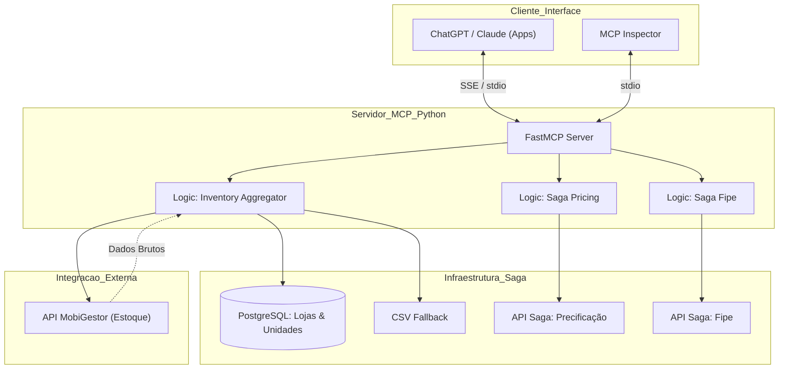

# 🏗️ Arquitetura: MCP Primeira Mão Saga

A arquitetura do projeto é baseada no protocolo **MCP (Model Context Protocol)**, utilizando uma abordagem de micro-serviços em Python para conectar modelos de linguagem a fontes de dados automotivas proprietárias.

## Sumário
- [Visão de Componentes](#visão-de-componentes)  
- [Descrição dos Serviços](#descrição-dos-serviços)  
- [Diagrama de Componentes](#diagrama-de-componentes)

---

## Visão de Componentes

A arquitetura distribui-se em camadas funcionais:

1. **Protocolo (Interface)**: FastMCP atuando como servidor de comunicação via stdio/SSE.
2. **Serviços (Lógica)**: Camada de agregação de estoque, consulta FIPE e motores de precificação.
3. **Integração (APIs)**: Conectores assíncronos para API externa (**MobiGestor**) e APIs internas (**Saga**).
4. **Persistência**: Banco de Dados PostgreSQL da Saga para gestão de unidades e configurações.
5. **Fallback**: Camada de resiliência baseada em arquivos CSV para garantir operabilidade offline.

## Descrição dos Serviços

- **FastMCP (Python)**: Framework core que expõe as `tools` (ferramentas) para o ChatGPT/Inspector.
- **Inventory Aggregator**: Serviço central que consolida o estoque de veículos seminovos.
- **Saga Fipe Service**: API interna do Grupo Saga para busca de dados técnicos e valores de referência via placa.
- **Saga Pricing Service**: Motor de precificação proprietário que calcula propostas de compra/troca.
- **PostgreSQL (Saga)**: Repositório oficial de mapeamento das lojas, unidades e credenciais.
- **MobiGestor API (Mobiauto)**: Única fonte externa, utilizada para busca de estoque bruto, fotos e opcionais.
- **Inspector/ChatGPT App**: Interfaces de consumo final que interagem com o servidor MCP.

## Diagrama de Componentes

