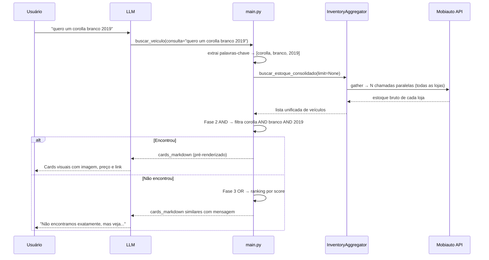
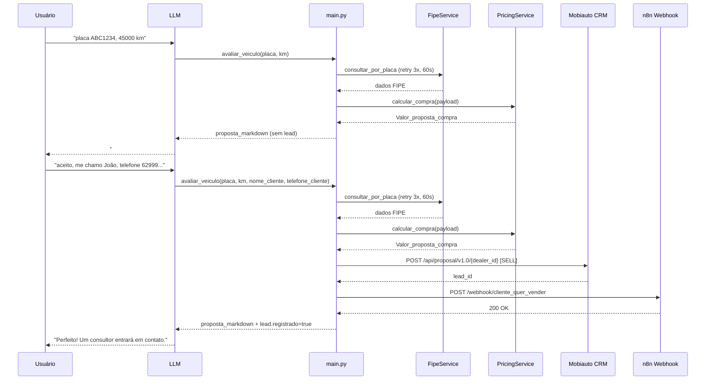

# Fluxo de Dados: MCP Primeira Mão Saga

---

## Fluxo 1 — Busca de estoque (`estoque_total`)

O usuário pede para ver os veículos disponíveis. O LLM chama `estoque_total(pagina=1)`.

```
1. Carrega lista de lojas
   └─ Cache hit → usa _lojas_cache
   └─ Cache miss → postgres_client → PostgreSQL ou CSV fallback

2. Obtém token Mobiauto
   └─ Cache hit → usa _token_cache
   └─ Cache miss → GET {URL_AWS_TOKEN}{MOBI_SECRET}

3. Seleciona 3 lojas da página solicitada

4. asyncio.gather → 3 chamadas paralelas à API Mobiauto
   └─ GET /api/dealer/{id}/inventory/v1.0
   └─ Filtra apenas veículos com imagem
   └─ Simplifica cada veículo: titulo_card, url_imagem, preco_formatado, link_ofertas

5. Se a página retornar vazia → avança automaticamente para a próxima

6. Se veiculos = [] → retorna mensagem de fallback (sem cards)
   Se veiculos > 0  → retorna cards_markdown pré-renderizado + _meta (uso interno)
```

---

## Fluxo 2 — Busca curinga (`buscar_veiculo`)

O usuário digita qualquer coisa: "quero um corolla branco 2019", "ABC1D23", "53480".

```
Fase 0 — Detecção de formato
   └─ Parece placa (ABC1234 / ABC1D23) ou ID numérico?
       → Sim: executa Fase 1
       → Não: pula direto para Fase 2

Fase 1 — ID / placa exata (só para placas/IDs)
   └─ asyncio.gather → busca em TODAS as lojas em paralelo
   └─ Encontrou → retorna 1 veículo com placa visível

Fase 2 — AND semântico (todas as palavras-chave batem)
   └─ Extrai palavras-chave: ignora stopwords ("quero", "um", "cor", etc.)
      "quero um corolla branco 2019" → ["corolla", "branco", "2019"]
   └─ buscar_estoque_consolidado(limit=None) → todos os veículos de todas as lojas
   └─ Filtra veículos onde TODOS os termos batem em algum campo
   └─ Encontrou → retorna resultados exatos

Fase 3 — OR com ranking (termos parciais)
   └─ Pontua cada veículo: quantos termos batem
   └─ Ordena por score decrescente
   └─ Encontrou → retorna com mensagem "veja as opções mais próximas"

Fase 4 — Sugestões gerais (nenhum termo bateu)
   └─ Se estoque vazio → mensagem de indisponibilidade temporária
   └─ Se estoque > 0   → retorna até 20 veículos com mensagem explicativa
```

---

## Fluxo 3 — Avaliação de veículo (`avaliar_veiculo`)

O cliente quer saber quanto vale seu carro para venda ou troca.

```
Entrada: placa + km (obrigatórios)
         uf, cor, existe_zero_km (opcionais — só se o cliente mencionar)
         nome_cliente, telefone_cliente (opcionais — acionam lead automático)

1. Normaliza placa → remove traços, maiúsculas (ex: "abc-1234" → "ABC1234")

2. Consulta FIPE pela placa (com retry automático)
   └─ GET {PRECIFICACAO_API_URL}/fipe?placa=ABC1234
   └─ Timeout: 60s por tentativa | Máximo: 3 tentativas | Espera 2s entre tentativas
   └─ Retorna: marca, modelo, versao, carroceria, combustivel, valor_fipe, codigo_fipe, ano_modelo
   └─ Erro FIPE → retorna dict de erro imediatamente

3. Monta payload de precificação (100% com dados da FIPE)
   └─ Campos técnicos: todos da FIPE
   └─ km: do cliente
   └─ uf / cor / existe_zero_km: do cliente se informou, senão padrão (GO / não / não)

4. Consulta API de precificação Saga
   └─ GET {PRECIFICACAO_API_URL}/carro/compra?placa=...&valor_fipe=...&...
   └─ Timeout: 30s
   └─ Erro → retorna dict de erro

5. Monta proposta_markdown:
   └─ Valor > 0 → "## 💰 Proposta de Compra" + tabela + prompt para nome/telefone
   └─ Valor = 0 → orientação de avaliação presencial + prompt para nome/telefone

6. Se nome_cliente + telefone_cliente informados → Fluxo 4 (lead de venda)
   Senão → retorna proposta_markdown para o LLM exibir e aguardar confirmação
```

---

## Fluxo 4 — Lead de venda automático (`_criar_lead_venda`)

Acionado internamente por `avaliar_veiculo` quando `nome_cliente` e `telefone_cliente` estão presentes.

```
1. Monta mensagem CRM com dados do veículo (placa, km, marca, modelo, ano, uf, proposta)

2. POST https://open-api.mobiauto.com.br/api/proposal/v1.0/{dealer_id}
   └─ intentionType: "SELL"
   └─ provider: id=245, name="Primeira Mão - Avaliação"
   └─ groupId: "948"
   └─ Bearer token Mobiauto (mesmo do estoque)
   └─ dealer_id: resolvido por UF → primeiro dealer cadastrado na UF do cliente

3. POST webhook venda (n8n)
   └─ URL: automatemaiawh.sagadatadriven.com.br/webhook/cliente_quer_vender
   └─ Payload: lead_id, nome_cliente, telefone_cliente, placa, km, veiculo_descricao,
               valor_proposta, preco_formatado, marca, modelo, ano_modelo, cor, uf, dealer_id

4. Retorna dentro do campo `lead` da resposta de avaliar_veiculo:
   └─ registrado: true/false
   └─ dealer_id
   └─ fallback_url: https://www.primeiramaosaga.com.br/vender/avaliar-veiculo/cliente
   └─ mensagem de confirmação
```

---

## Fluxo 5 — Lead de compra automático (`_criar_lead_compra`)

Acionado internamente por `estoque_total` ou `buscar_veiculo` quando `nome_cliente` e `telefone_cliente` estão presentes.

```
1. Monta mensagem CRM com dados do veículo (titulo_card, loja, placa, ano, km, cor, preço)

2. POST https://open-api.mobiauto.com.br/api/proposal/v1.0/{dealer_id}
   └─ intentionType: "BUY"
   └─ provider: id=11, name="Site"
   └─ groupId: "948"
   └─ Bearer token Mobiauto
   └─ dealer_id: resolvido pelo nome da loja → primeiro match no cadastro

3. POST webhook compra (n8n)
   └─ URL: automatemaiawh.sagadatadriven.com.br/webhook/cliente_quer_comprar
   └─ Payload: lead_id, nome_cliente, telefone_cliente, titulo_card, veiculo_id,
               preco_formatado, loja_unidade, plate, modelYear, km, colorName, dealer_id

4. Retorna diretamente (não aninhado):
   └─ registrado: true/false
   └─ dealer_id
   └─ fallback_url: https://www.primeiramaosaga.com.br/gradedeofertas
   └─ mensagem de confirmação
```

---

## Diagrama de sequência — Busca curinga



---

## Diagrama de sequência — Lead de venda (via avaliar_veiculo)



---

## Paginação do estoque

```
Total de lojas: N (49 no mock, variável no banco)
Lojas por página: 3
Total de páginas: ceil(N / 3)

pagina=1 → lojas[0:3]
pagina=2 → lojas[3:6]
...

Se a página X retornar 0 veículos com imagem → avança automaticamente para X+1
Se todas as páginas retornarem vazias → mensagem de indisponibilidade temporária
```

---

## Resolução de dealer_id (lookup de loja)

```
Prioridade para criação de lead:

1. loja_nome → busca exata no cadastro → busca parcial
2. uf_fallback → primeiro dealer na UF informada
3. Primeira loja da lista (fallback final)
```
