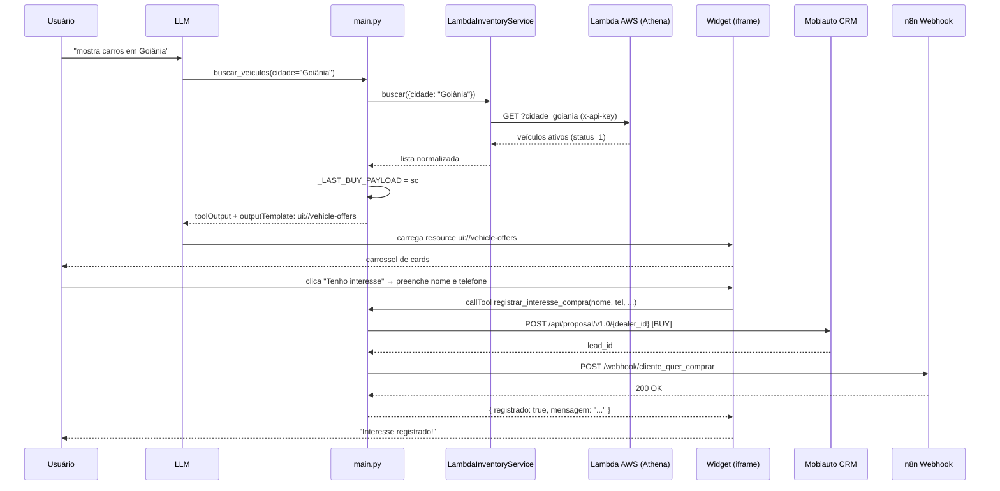
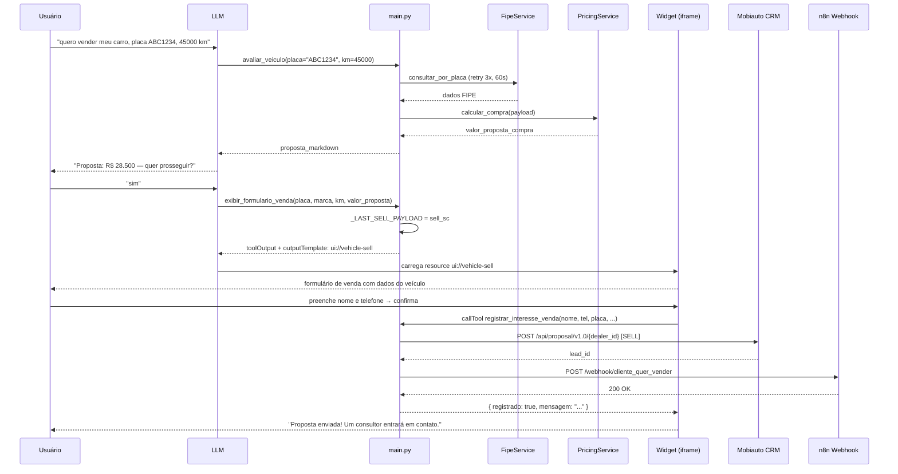

# Fluxo de Dados: MCP Primeira Mão Saga

---

## Fluxo 1 — Busca visual de veículos (`buscar_veiculos`)

O usuário pede para ver veículos disponíveis. O LLM chama `buscar_veiculos(cidade, ...)`.

```
Entrada: cidade (obrigatório) + filtros opcionais:
         marca, modelo, versao, preco_min, preco_max, km_max, ano_min, ano_max, limit

1. LambdaInventoryService.buscar(params)
   └─ GET {LAMBDA_ESTOQUE_URL}?cidade=...&marca=...
      x-api-key: {LAMBDA_API_KEY}
   └─ Lambda executa SELECT Athena em modelled.pm_deal WHERE d.status = 1 AND cidade = ?
   └─ Retorna lista de veículos com id, marca, modelo, versao, preço, km, ano, loja, url, url_imagem

2. Monta structured content (sc):
   └─ { vehicles: [...], city: "Goiânia", count: N }

3. Armazena _LAST_BUY_PAYLOAD = sc

4. Retorna tool result com openai/outputTemplate: "ui://vehicle-offers"
   └─ ChatGPT lê o resource ui://vehicle-offers (HTML inline)
   └─ HTML contém: CSS inline + JSON payload (#vehicle-data) + JS inline

5. Widget carrega no iframe do ChatGPT Apps:
   └─ JS extrai payload de #vehicle-data (sem polling)
   └─ Se toolOutput disponível → usa structured content do toolOutput
   └─ Polling 200 ms × 25 vezes → fallback se toolOutput demorar
   └─ Renderiza carrossel: título, marca, km, preço, imagem, link, botão "Tenho interesse"
```

---

## Fluxo 2 — Interesse de compra (`registrar_interesse_compra`)

O usuário clica em "Tenho interesse" num card do widget. O widget chama `callTool` internamente.

```
Entrada: nome_cliente, telefone_cliente, titulo_veiculo, loja_unidade,
         preco_formatado, veiculo_id

1. Widget JS → window.openai.callTool('registrar_interesse_compra', {...})
   └─ Bridge MCP nativa do ChatGPT Apps

2. _criar_lead_compra(nome, telefone, titulo, loja, preco, veiculo_id)

3. Resolve dealer_id:
   └─ busca exata no cadastro de lojas por loja_unidade
   └─ busca parcial (contains)
   └─ fallback: primeira loja da lista

4. POST https://open-api.mobiauto.com.br/api/proposal/v1.0/{dealer_id}
   └─ intentionType: "BUY"
   └─ provider: id=11, name="Site"
   └─ groupId: "948"
   └─ Bearer token Mobiauto (renovado automaticamente no 401)

5. POST webhook compra (n8n) — fire-and-forget
   └─ URL: automatemaiawh.sagadatadriven.com.br/webhook/cliente_quer_comprar
   └─ Payload: lead_id, nome_cliente, telefone_cliente, titulo_card, veiculo_id,
               preco_formatado, loja_unidade, plate, modelYear, km, colorName, dealer_id

6. Retorna ao widget:
   └─ registrado: true/false
   └─ mensagem de confirmação
   └─ fallback_url: https://www.primeiramaosaga.com.br/gradedeofertas
```

---

## Fluxo 3 — Busca textual (`buscar_veiculo`)

O usuário digita qualquer coisa: "quero um corolla branco 2019", "ABC1D23", "53480".

```
Fase 0 — Detecção de formato
   └─ Parece placa (ABC1234 / ABC1D23) ou ID numérico?
       → Sim: executa Fase 1
       → Não: pula direto para Fase 2

Fase 1 — ID / placa exata (só para placas/IDs)
   └─ asyncio.gather → busca em TODAS as lojas em paralelo (InventoryAggregator)
   └─ Encontrou → retorna 1 veículo com placa visível

Fase 2 — AND semântico (todas as palavras-chave batem)
   └─ Extrai palavras-chave: ignora stopwords ("quero", "um", "cor", etc.)
      "quero um corolla branco 2019" → ["corolla", "branco", "2019"]
   └─ buscar_estoque_consolidado(limit=None) → todos os veículos de todas as lojas
   └─ Filtra veículos onde TODOS os termos batem em algum campo
   └─ Encontrou → retorna resultados em Markdown

Fase 3 — OR com ranking (termos parciais)
   └─ Pontua cada veículo: quantos termos batem
   └─ Ordena por score decrescente
   └─ Encontrou → retorna com mensagem "veja as opções mais próximas"

Fase 4 — Sugestões gerais (nenhum termo bateu)
   └─ Se estoque vazio → mensagem de indisponibilidade temporária
   └─ Se estoque > 0   → retorna até 20 veículos com mensagem explicativa

Nota: buscar_veiculo usa InventoryAggregator (fallback Mobiauto), não a Lambda.
      Retorna texto Markdown, sem widget.
```

---

## Fluxo 4 — Listagem de estoque (`estoque_total`)

```
Entrada: cidade (obrigatório), pagina (default: 1)

1. Carrega lista de lojas
   └─ Cache hit → usa _lojas_cache
   └─ Cache miss → postgres_client → PostgreSQL ou CSV fallback

2. Obtém token Mobiauto
   └─ Cache hit → usa _token_cache
   └─ Cache miss → GET {URL_AWS_TOKEN}{MOBI_SECRET}

3. Seleciona 3 lojas da página solicitada (lojas[(pag-1)*3 : pag*3])

4. asyncio.gather → 3 chamadas paralelas à API Mobiauto
   └─ GET /api/dealer/{id}/inventory/v1.0
   └─ Filtra apenas veículos com imagem

5. Se a página retornar vazia → avança automaticamente para a próxima

6. Retorna listagem Markdown (sem widget)
```

---

## Fluxo 5 — Avaliação de veículo (`avaliar_veiculo`)

O cliente quer saber quanto vale seu carro para venda ou troca.

```
Entrada: placa + km (obrigatórios)
         uf, cor, existe_zero_km (opcionais)

1. Normaliza placa → remove traços, maiúsculas (ex: "abc-1234" → "ABC1234")

2. Consulta FIPE pela placa (com retry automático)
   └─ GET {PRECIFICACAO_API_URL}/fipe?placa=ABC1234
   └─ Timeout: 60s por tentativa | Máximo: 3 tentativas | Espera 2s entre tentativas
   └─ Retorna: marca, modelo, versao, carroceria, combustivel, valor_fipe, codigo_fipe, ano_modelo
   └─ Erro FIPE → retorna dict de erro imediatamente

3. Monta payload de precificação com dados da FIPE + km/uf/cor do cliente

4. Consulta API de precificação Saga
   └─ GET {PRECIFICACAO_API_URL}/carro/compra?placa=...&valor_fipe=...&...
   └─ Timeout: 20s
   └─ Erro → retorna dict de erro

5. Retorna proposta_markdown ao LLM:
   └─ Valor > 0 → tabela com dados FIPE + proposta Saga
   └─ Valor = 0 → orientação de avaliação presencial

6. LLM exibe proposta e pergunta se o cliente quer prosseguir
   └─ Para coletar dados do vendedor → LLM chama exibir_formulario_venda
```

---

## Fluxo 6 — Widget de venda (`exibir_formulario_venda`)

Chamado pelo LLM após a avaliação, para coletar nome e telefone do cliente que quer vender.

```
Entrada: placa, marca, km, valor_proposta (obrigatórios)
         modelo, ano, cor, uf (opcionais)

1. Monta sell_sc:
   └─ { mode: "sell", placa, marca, modelo, ano, km, cor, uf, valor_proposta }

2. Armazena _LAST_SELL_PAYLOAD = sell_sc
   (variável separada de _LAST_BUY_PAYLOAD — evita race condition entre sessões)

3. Retorna tool result com openai/outputTemplate: "ui://vehicle-sell"
   └─ ChatGPT lê o resource ui://vehicle-sell (HTML inline)
   └─ Mesmo JS/CSS que o widget de compra; modo determinado por sell_sc.mode = "sell"

4. Widget renderiza formulário de venda:
   └─ Exibe: marca, placa, km, proposta Saga
   └─ Campos: nome + telefone
   └─ Ao confirmar: window.openai.callTool('registrar_interesse_venda', {...})
```

---

## Fluxo 7 — Interesse de venda (`registrar_interesse_venda`)

O usuário preenche o formulário de venda e clica em confirmar. O widget chama `callTool`.

```
Entrada: nome_cliente, telefone_cliente, placa, km, marca, modelo,
         ano_modelo, cor, uf, valor_proposta, preco_formatado

1. Widget JS → window.openai.callTool('registrar_interesse_venda', {...})

2. _criar_lead_venda(nome, telefone, placa, km, marca, modelo, ...)

3. Resolve dealer_id por UF:
   └─ primeiro dealer cadastrado na UF informada
   └─ fallback: primeira loja da lista

4. POST https://open-api.mobiauto.com.br/api/proposal/v1.0/{dealer_id}
   └─ intentionType: "SELL"
   └─ provider: id=245, name="Primeira Mão - Avaliação"
   └─ groupId: "948"
   └─ Bearer token Mobiauto (renovado automaticamente no 401)

5. POST webhook venda (n8n) — fire-and-forget
   └─ URL: automatemaiawh.sagadatadriven.com.br/webhook/cliente_quer_vender
   └─ Payload: lead_id, nome_cliente, telefone_cliente, placa, km, veiculo_descricao,
               valor_proposta, preco_formatado, marca, modelo, ano_modelo, cor, uf, dealer_id

6. Retorna ao widget:
   └─ registrado: true/false
   └─ mensagem de confirmação
   └─ fallback_url: https://www.primeiramaosaga.com.br/vender/avaliar-veiculo/cliente
```

---

## Diagrama de sequência — Compra via widget



---

## Diagrama de sequência — Venda via widget



---

## Resolução de dealer_id (lookup de loja)

```
Prioridade para lead de COMPRA (por nome de loja):
1. busca exata em cadastro de lojas → loja_unidade == nome_loja
2. busca parcial (contains)
3. primeira loja da lista (fallback final)

Prioridade para lead de VENDA (por UF):
1. primeiro dealer na UF informada
2. primeira loja da lista (fallback final)
```

---

## Cache e estado em memória

```
_LAST_BUY_PAYLOAD   → definido por buscar_veiculos
                       lido por resource ui://vehicle-offers
                       resetado a cada nova chamada de buscar_veiculos

_LAST_SELL_PAYLOAD  → definido por exibir_formulario_venda
                       lido por resource ui://vehicle-sell
                       resetado a cada nova chamada de exibir_formulario_venda

_token_cache        → Bearer token Mobiauto, renovado automaticamente no 401
_lojas_cache        → lista de lojas (PostgreSQL ou CSV), carregado uma vez por sessão
```

---

## Paginação do estoque (`estoque_total`)

```
Total de lojas: N (variável — lido do banco ou CSV)
Lojas por página: 3
Total de páginas: ceil(N / 3)

pagina=1 → lojas[0:3]
pagina=2 → lojas[3:6]
...

Se a página X retornar 0 veículos com imagem → avança automaticamente para X+1
Se todas as páginas retornarem vazias → mensagem de indisponibilidade temporária
```
