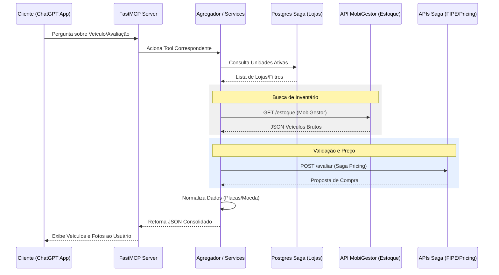

# 🔄 Fluxo de Dados: MCP Primeira Mão Saga

Este documento descreve o ciclo de vida de uma requisição, desde a interação do usuário com a IA até a entrega dos dados consolidados de seminovos.

## Sumário
- [Sequência de Execução](#sequência-de-execução)  
- [Detalhamento das Etapas](#detalhamento-das-etapas)  
- [Diagrama de Sequência](#diagrama-de-sequência)

---

## Sequência de Execução

1. **User Prompt**: O usuário solicita um veículo ou avaliação via ChatGPT App.
2. **MCP Tool Call**: O LLM identifica e aciona a ferramenta apropriada no FastMCP.
3. **Service Logic**: O servidor processa a lógica de negócio (Agregador, FIPE ou Pricing).
4. **Data Retrieval**: Consulta ao PostgreSQL (Saga) e API externa (MobiGestor).
5. **Data Normalization**: Tratamento de placas, preços e strings para padrão Saga.
6. **LLM Response**: O MCP devolve o JSON estruturado que a IA transforma em resposta amigável.

## Detalhamento das Etapas

- **User Prompt**: Entrada em linguagem natural (ex: "Quero um Nivus seminovo abaixo de 120 mil").
- **MCP Tool Call**: Tradução da intenção para chamadas como `search_veiculos(modelo='Nivus', preco_max=120000)`.
- **Service Logic**: O `InventoryAggregator` decide se busca dados vivos ou usa cache de lojas.
- **Data Retrieval**: 
    - Busca de lojas e unidades no **PostgreSQL Saga**.
    - Busca de estoque em tempo real na **API MobiGestor**.
    - Consulta de valores na **API Saga FIPE/Pricing**.
- **Data Normalization**: Funções auxiliares garantem que "R$ 100.000,00" vire "100000.00" para cálculos e vice-versa para exibição.
- **LLM Response**: Formatação final que permite à IA exibir fotos e detalhes técnicos do Primeira Mão.

## Diagrama de Sequência

