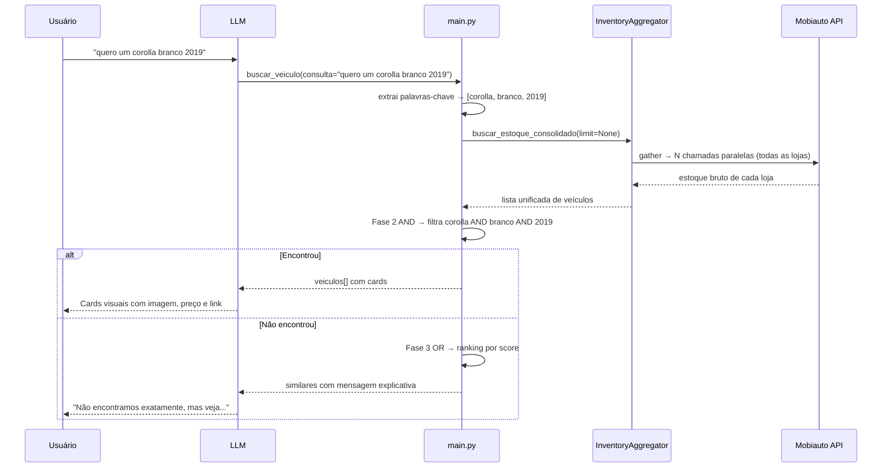
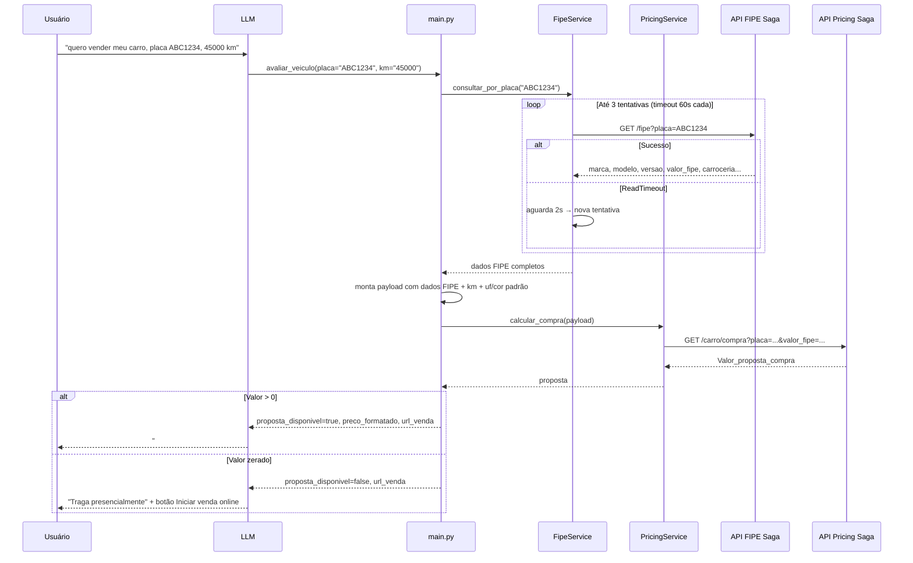

# Fluxo de Dados: MCP Primeira Mão Saga

---

## Fluxo 1 — Busca de estoque (`estoque_total`)

O usuário pede para ver os veículos disponíveis. O LLM chama `estoque_total(pagina=1)`.

```
1. Carrega lista de lojas
   └─ Cache hit → usa _lojas_cache
   └─ Cache miss → postgres_client → PostgreSQL ou CSV fallback

2. Obtém token Mobiauto
   └─ Cache hit → usa _token_cache
   └─ Cache miss → GET {URL_AWS_TOKEN}{MOBI_SECRET}

3. Seleciona 3 lojas da página solicitada

4. asyncio.gather → 3 chamadas paralelas à API Mobiauto
   └─ GET /api/dealer/{id}/inventory/v1.0
   └─ Filtra apenas veículos com imagem
   └─ Simplifica cada veículo: titulo_card, url_imagem, preco_formatado, link_ofertas

5. Se a página retornar vazia → avança automaticamente para a próxima

6. Retorna JSON com veiculos[] + _meta (uso interno, não exibido ao cliente)
```

---

## Fluxo 2 — Busca curinga (`buscar_veiculo`)

O usuário digita qualquer coisa: "quero um corolla branco 2019", "ABC1D23", "53480".

```
Fase 0 — Detecção de formato
   └─ Parece placa (ABC1234 / ABC1D23) ou ID numérico?
       → Sim: executa Fase 1
       → Não: pula direto para Fase 2

Fase 1 — ID / placa exata (só para placas/IDs)
   └─ asyncio.gather → busca em TODAS as lojas em paralelo
   └─ Encontrou → retorna 1 veículo

Fase 2 — AND semântico (todas as palavras-chave batem)
   └─ Extrai palavras-chave: ignora stopwords ("quero", "um", "cor", etc.)
      "quero um corolla branco 2019" → ["corolla", "branco", "2019"]
   └─ buscar_estoque_consolidado(limit=None) → todos os veículos de todas as lojas
   └─ Filtra veículos onde TODOS os termos batem em algum campo
   └─ Encontrou → retorna resultados exatos

Fase 3 — OR com ranking (termos parciais)
   └─ Pontua cada veículo: quantos termos batem
   └─ Ordena por score decrescente
   └─ Encontrou → retorna com mensagem "veja as opções mais próximas"

Fase 4 — Sugestões gerais (nenhum termo bateu)
   └─ Retorna até 20 veículos do estoque com mensagem explicativa
   └─ NUNCA retorna vazio
```

---

## Fluxo 3 — Avaliação de veículo (`avaliar_veiculo`)

O cliente quer saber quanto vale seu carro para venda ou troca.

```
Entrada: placa + km (obrigatórios)
         uf, cor, existe_zero_km (opcionais — só se o cliente mencionar)

1. Normaliza placa → remove traços, maiúsculas (ex: "abc-1234" → "ABC1234")

2. Consulta FIPE pela placa (com retry automático)
   └─ GET {PRECIFICACAO_API_URL}/fipe?placa=ABC1234
   └─ Timeout: 60s por tentativa | Máximo: 3 tentativas | Espera 2s entre tentativas
   └─ Retorna: marca, modelo, versao, carroceria, combustivel, valor_fipe, codigo_fipe, ano_modelo

3. Monta payload de precificação (100% com dados da FIPE)
   └─ Campos técnicos: todos da FIPE
   └─ km: do cliente
   └─ uf / cor / existe_zero_km: do cliente se informou, senão padrão (GO / não / não)

4. Consulta API de precificação Saga
   └─ GET {PRECIFICACAO_API_URL}/carro/compra?placa=...&valor_fipe=...&...
   └─ Timeout: 30s

5. Retorno ao LLM:
   └─ proposta_disponivel = true
       → preco_formatado + url_venda
       → LLM exibe: "## 💰 Proposta de Compra" + botão [🚗 Vender meu carro agora]
   └─ proposta_disponivel = false (valor zerado)
       → mensagem para avaliação presencial
       → LLM exibe botão [🚗 Iniciar venda online]
```

---

## Diagrama de sequência — Busca curinga



---

## Diagrama de sequência — Avaliação de veículo



---

## Paginação do estoque

```
Total de lojas: N
Lojas por página: 3
Total de páginas: ceil(N / 3)

pagina=1 → lojas[0:3]
pagina=2 → lojas[3:6]
...

Se a página X retornar 0 veículos com imagem → avança automaticamente para X+1
```
