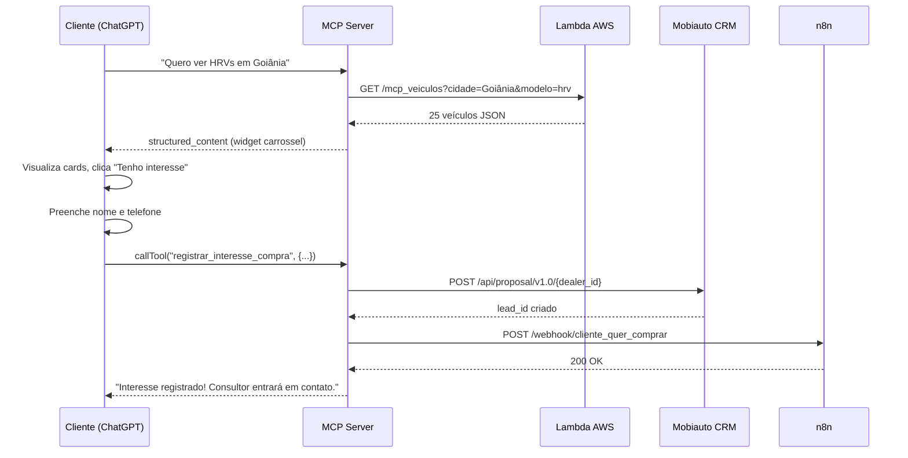
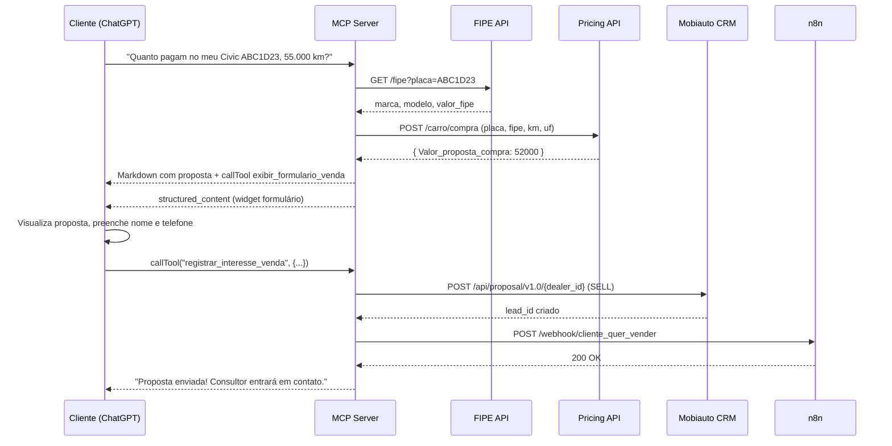
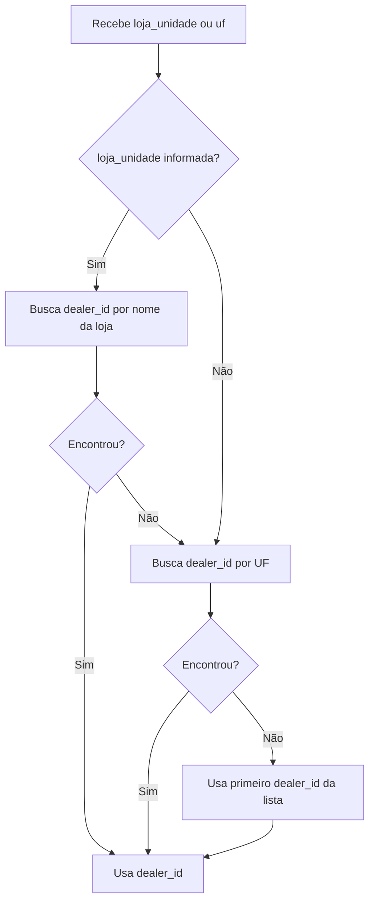
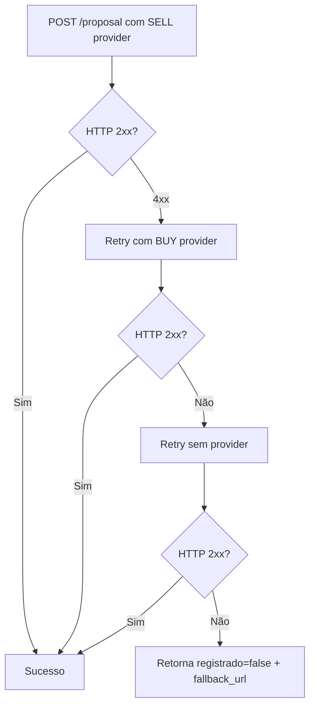

# Fluxo de Dados — MCP Primeira Mão Saga

---

## Fluxo 1 — Busca visual de veículos (`buscar_veiculos`)

**Gatilho**: Cliente pede veículos em linguagem natural.  
*"Quero ver SUVs disponíveis em Goiânia até R$ 80.000"*

```
LLM chama buscar_veiculos(cidade="Goiânia", preco_max=80000)
  │
  ├─ LambdaInventoryService.buscar(cidade, filtros)
  │    ├─ GET Lambda AWS (x-api-key)
  │    ├─ Lambda executa query Athena (modelled.pm_*)
  │    └─ Retorna lista de veículos com imagem e status=1
  │
  ├─ [se Lambda vazia] InventoryAggregator.buscar_estoque_por_lojas()
  │    └─ GET Mobiauto /api/dealer/{id}/inventory/v1.0 (fallback)
  │
  ├─ Filtra veículos com imagem
  ├─ Aplica scoring por palavras-chave se consulta textual fornecida
  ├─ Limita a 20 veículos
  │
  └─ Retorna structured_content:
       {
         "type": "vehicle_cards",
         "vehicles": [...],
         "searchContext": { "city": "GOIÂNIA", "store": "..." }
       }

ChatGPT renderiza recurso ui://vehicle-offers
  └─ iframe com carrossel de cards
```

**Dados armazenados**: `_LAST_BUY_PAYLOAD` no servidor (fallback para HTML cached)

---

## Fluxo 2 — Registro de interesse de compra (`registrar_interesse_compra`)

**Gatilho**: Cliente clica em "Tenho interesse" no carrossel, preenche nome e telefone e clica em enviar.

```
Widget chama window.openai.callTool("registrar_interesse_compra", {
  nome_cliente, telefone_cliente, titulo_veiculo,
  veiculo_id, preco_formatado, loja_unidade, plate, ...
})
  │
  ├─ _criar_lead_compra()
  │    ├─ MobiautoProposalService.criar_lead(intention_type="BUY")
  │    │    ├─ GET token AWS
  │    │    ├─ Resolve dealer_id (loja_nome → UF → primeiro)
  │    │    ├─ POST /api/proposal/v1.0/{dealer_id}
  │    │    └─ [falha 4xx] retry sem provider
  │    │
  │    └─ _disparar_webhook(_WH_COMPRA)
  │         └─ POST n8n cliente_quer_comprar
  │              └─ n8n notifica consultor da loja
  │
  └─ Retorna { registrado: true, dealer_id, mensagem }
```

---

## Fluxo 3 — Busca textual (`buscar_veiculo`)

**Gatilho**: LLM chama com consulta específica (placa, ID ou modelo).

```
buscar_veiculo(consulta="ABC1D23", cidade="Goiânia")
  │
  ├─ Fase 1: _parece_id_ou_placa() → buscar_veiculo_especifico()
  │
  ├─ Fase 2: AND — todas as palavras-chave devem estar presentes
  │
  ├─ Fase 3: OR com scoring — pontuação por quantidade de matches
  │
  └─ Fase 4: Fallback — sugestões de modelos similares
```

Saída: Markdown com cards renderizados por `_renderizar_cards()`.

---

## Fluxo 4 — Listagem de estoque (`estoque_total`)

```
estoque_total(cidade="Goiânia")
  │
  ├─ Filtra lojas pela cidade
  ├─ GET Mobiauto por loja
  ├─ Filtra veículos com imagem
  └─ Renderiza até 25 cards em Markdown
```

---

## Fluxo 5 — Avaliação de veículo (`avaliar_veiculo`)

**Gatilho**: Cliente informa placa e KM do seu carro.  
*"Quanto pagam no meu Corolla placa TST1T23, 60.000 km?"*

```
avaliar_veiculo(placa="TST1T23", km=60000, uf="GO")
  │
  ├─ normalizar_placa("TST1T23") → "TST1T23"
  │
  ├─ FipeService.consultar_por_placa("TST1T23")
  │    ├─ GET /fipe?placa=TST1T23  [timeout 60s, retry 3×]
  │    └─ Retorna: marca, modelo, versão, valor_fipe, combustível, ano
  │
  ├─ PricingService.calcular_compra({
  │     placa, valor_fipe, marca, modelo, versao,
  │     combustivel, ano_modelo, uf, km, cor, existe_zero_km
  │   })
  │    └─ POST PRECIFICACAO_API_URL/carro/compra
  │         └─ Retorna: { "Valor_proposta_compra": 28500.00 }
  │
  └─ Formata resposta Markdown com veículo + proposta
       → LLM DEVE chamar exibir_formulario_venda() imediatamente após
```

---

## Fluxo 6 — Widget de formulário de venda (`exibir_formulario_venda`)

**Gatilho**: Chamado pelo LLM imediatamente após `avaliar_veiculo`.

```
exibir_formulario_venda(
  veiculo_descricao="Toyota Corolla 2019",
  placa="TST1T23",
  km=60000,
  valor_proposta="R$ 28.500,00"
)
  │
  ├─ Formata valor (garante prefixo "R$")
  ├─ Armazena em _LAST_SELL_PAYLOAD
  │
  └─ Retorna structured_content:
       { "mode": "sell", "evaluation": { vehicleDescription, plate, km, proposal } }

ChatGPT renderiza recurso ui://vehicle-sell
  └─ iframe com formulário compacto (máx 420px, centralizado)
       Campos: nome, telefone
       Exibe: veículo, placa, km, proposta
```

---

## Fluxo 7 — Registro de interesse de venda (`registrar_interesse_venda`)

**Gatilho**: Cliente preenche nome e telefone no formulário de venda e clica em confirmar.

```
Widget chama window.openai.callTool("registrar_interesse_venda", {
  nome_cliente, telefone_cliente, placa, km,
  veiculo_descricao, valor_proposta, email_cliente
})
  │
  ├─ _criar_lead_venda()
  │    ├─ MobiautoProposalService.criar_lead(intention_type="SELL")
  │    │    ├─ GET token AWS
  │    │    ├─ Resolve dealer_id por UF
  │    │    ├─ POST /api/proposal/v1.0/{dealer_id}
  │    │    └─ [falha SELL] retry com provider BUY → retry sem provider
  │    │
  │    └─ _disparar_webhook(_WH_VENDA)
  │         └─ POST n8n cliente_quer_vender
  │              └─ n8n notifica consultor de avaliação
  │
  └─ Retorna { registrado: true, dealer_id, mensagem }
```

---

## Diagrama de sequência — Compra



---

## Diagrama de sequência — Venda



---

## Resolução de dealer_id



---

## Tratamento de falha no CRM (SELL)


