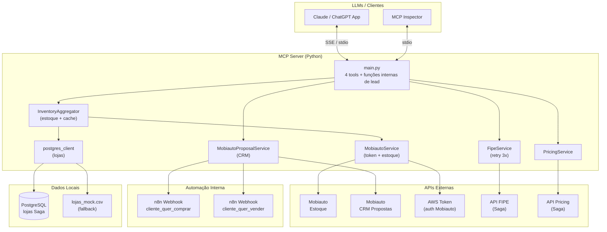

# Visão Geral das Integrações

## Diagrama de Integrações

## Resumo das Integrações

| Sistema | Tipo | Direção | Propósito |
|---|---|---|---|
| Mobiauto Inventory API | REST GET | Entrada | Buscar estoque de veículos por dealer |
| Mobiauto CRM Proposal API | REST POST | Saída | Criar leads de compra (BUY) e venda (SELL) |
| AWS Token (Mobiauto Auth) | REST GET | Entrada | Obter Bearer token para autenticação Mobiauto |
| API FIPE Saga | REST GET | Entrada | Dados técnicos e valor FIPE pela placa |
| API Pricing Saga | REST GET | Entrada | Proposta de compra/troca baseada em FIPE + km |
| n8n Webhook Compra | HTTP POST | Saída | Notificar consultores quando lead de compra é criado |
| n8n Webhook Venda | HTTP POST | Saída | Notificar consultores quando lead de venda é criado |
| PostgreSQL Saga | SQL | Entrada | Lista de lojas com dealer_id para o programa Primeira Mão |
| lojas_mock.csv | Arquivo local | Entrada (fallback) | Cópia local das 49 lojas — ativada quando banco indisponível |
