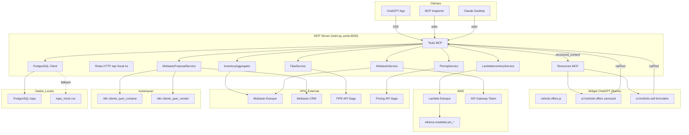

# Visão Geral das Integrações

## Diagrama de Integrações



---

## Tabela de integrações

| Serviço | Tipo | Direção | Arquivo | Autenticação |
|---|---|---|---|---|
| Lambda AWS (estoque) | REST | OUT | `lambda_inventory_service.py` | `x-api-key` header |
| Mobiauto Estoque | REST | OUT | `mobiauto_service.py` | Bearer token |
| Mobiauto CRM (leads) | REST | OUT | `mobiauto_proposal_service.py` | Bearer token |
| Token AWS | REST | OUT | `mobiauto_service.py` | `MOBI_SECRET` |
| FIPE API Saga | REST | OUT | `fipe_service.py` | Nenhuma (interna) |
| Pricing API Saga | REST | OUT | `pricing_service.py` | Nenhuma (interna) |
| n8n cliente_quer_comprar | Webhook POST | OUT | `main.py` | Nenhuma (rede interna) |
| n8n cliente_quer_vender | Webhook POST | OUT | `main.py` | Nenhuma (rede interna) |
| PostgreSQL | TCP | OUT | `postgres_client.py` | DB_USER/PASSWORD |
| ChatGPT Apps | SSE (MCP) | IN | `main.py` | Verificação domínio OpenAI |
| MCP Inspector / Claude | stdio (MCP) | IN | `main.py` | Nenhuma (local) |

---

## Bridge Widget → Tool

O widget (iframe) pode chamar tools MCP diretamente usando a API do ChatGPT Apps:

```javascript
// Dentro do vehicle-offers.js (widget de compra)
window.openai.callTool("registrar_interesse_compra", {
  nome_cliente:     "João Silva",
  telefone_cliente: "62999990001",
  titulo_veiculo:   "Honda Civic Touring 2021",
  veiculo_id:       "53480",
  preco_formatado:  "R$ 89.900",
  loja_unidade:     "SN GO BURITI",
  plate:            "ABC1D23",
  modelYear:        "2021",
  km:               "32000"
})

// Widget de venda
window.openai.callTool("registrar_interesse_venda", {
  nome_cliente:      "Maria Souza",
  telefone_cliente:  "62988880002",
  placa:             "TST1T23",
  km:                "50000",
  veiculo_descricao: "Toyota Corolla 2019",
  valor_proposta:    "R$ 28.500,00"
})
```

Esse padrão permite que o lead seja registrado sem que o LLM precise intervir após a interação do usuário com o widget.

---

## Detalhes de cada integração

### Lambda AWS (estoque)

- **URL**: `LAMBDA_ESTOQUE_URL` (API Gateway)
- **Método**: GET com query params
- **Timeouts**: `API_TIMEOUT` (padrão 30s)
- **Autenticação**: `x-api-key: LAMBDA_API_KEY`
- **Resposta**: array JSON de veículos ou payload proxy `{"body": "..."}`
- **Normalização**: `LambdaInventoryService._normalizar()` converte para schema interno

### Mobiauto Estoque

- **URL**: `https://open-api.mobiauto.com.br/api/dealer/{id}/inventory/v1.0`
- **Método**: GET
- **Token**: obtido via `URL_AWS_TOKEN?mobi_secret={MOBI_SECRET}`, cacheado em memória
- **Renovação**: automática em HTTP 401
- **Timeout**: `API_TIMEOUT` (padrão 30s)

### Mobiauto CRM (criação de leads)

- **URL**: `https://open-api.mobiauto.com.br/api/proposal/v1.0/{dealer_id}`
- **Método**: POST JSON
- **Tipos**: `intention_type = "BUY"` ou `"SELL"`
- **Fallback de SELL**: tenta BUY provider → sem provider
- **Grupo**: `groupId: 948` (fixo)
- **Timeout**: 15s

### FIPE API Saga

- **Método**: GET `/fipe?placa={placa}`
- **Timeout**: 60s
- **Retry**: até 3 tentativas com delay de 2s em timeout
- **Resposta**: dict ou array (normalizado pelo serviço)

### Pricing API Saga

- **Método**: POST `/carro/compra`
- **Timeout**: `API_TIMEOUT` (padrão 30s)
- **Erros 400**: retorna detalhes de validação
- **Erros 5xx**: retorna mensagem genérica

### Webhooks n8n

| Webhook | Endpoint | Ativado por |
|---|---|---|
| `cliente_quer_comprar` | `https://automatemaiawh.sagadatadriven.com.br/webhook/cliente_quer_comprar` | `registrar_interesse_compra` |
| `cliente_quer_vender` | `https://automatemaiawh.sagadatadriven.com.br/webhook/cliente_quer_vender` | `registrar_interesse_venda` |

- **Método**: POST JSON
- **Timeout**: 10s
- **Retry**: não; falha é logada mas não impede retorno ao cliente
